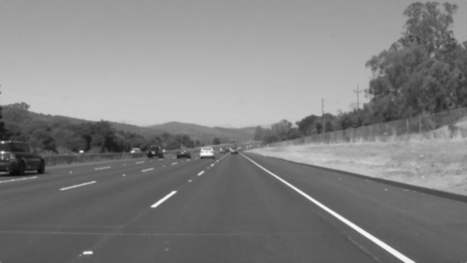
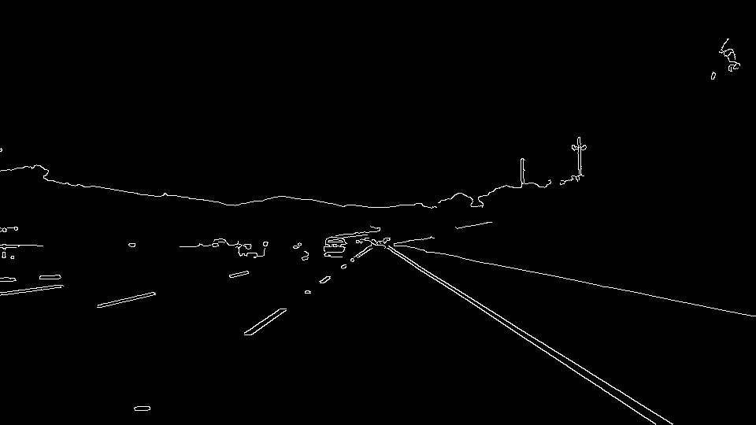
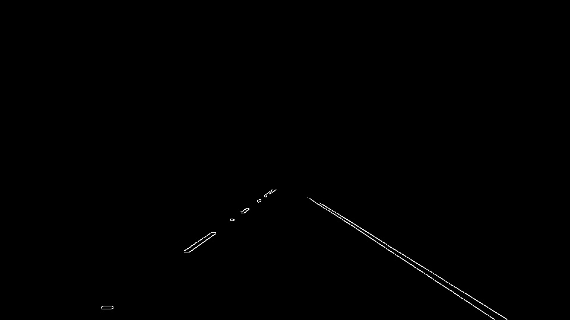
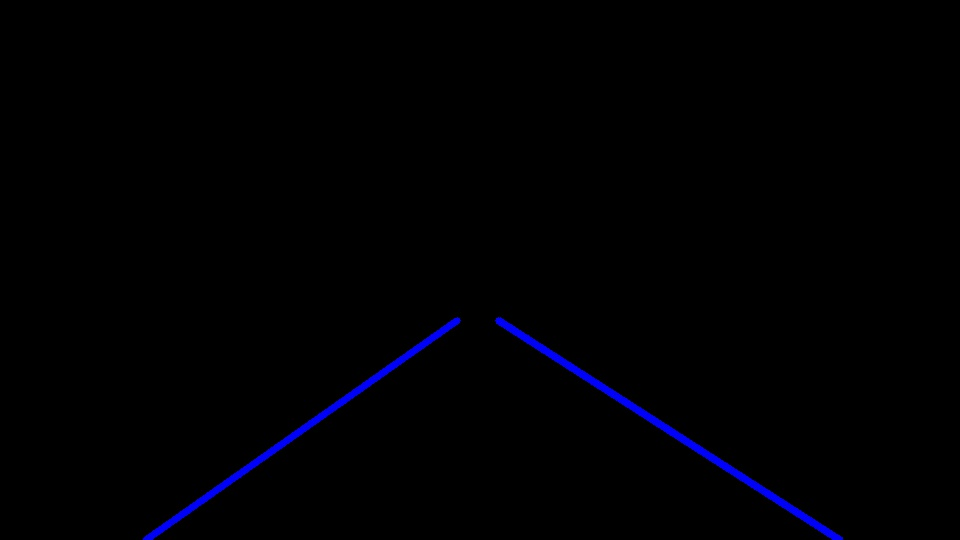
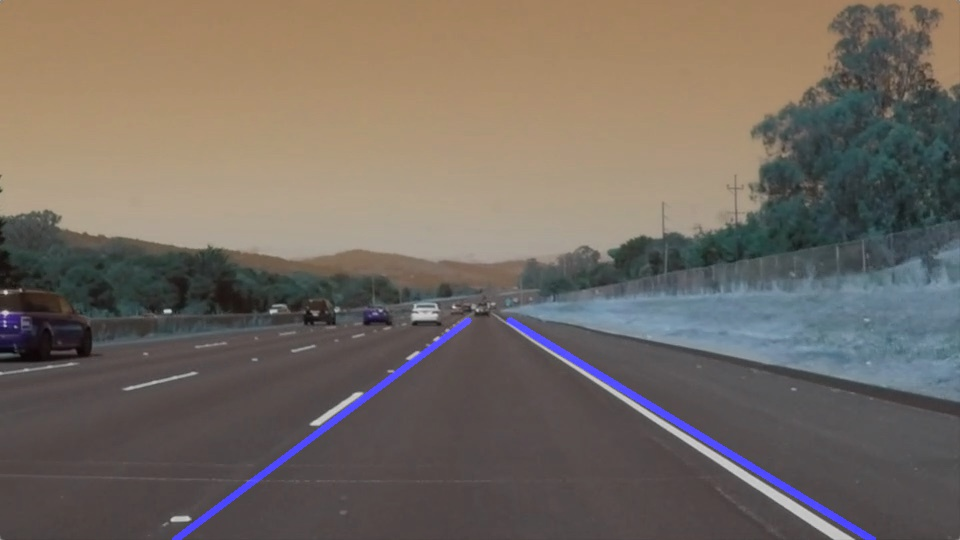

# **Finding Lane Lines on the Road** 

## Writeup

---

**Finding Lane Lines on the Road**

The goals / steps of this project are the following:
* Make a pipeline that finds lane lines on the road
* Reflect on your work in a written report

---

### Reflection

### 1. Describe your pipeline. As part of the description, explain how you modified the draw_lines() function.

My pipeline consisted of following 6 steps:

1. the images are converted to grayscale 

2. the grayscale images are smoothed using gaussian blur function with kernel size of 5

3. the canny function is used to detect the edges with low_threshold = 50 and high_threshold = 220

4. masked specific region of the images since we want only to get the edges on this region

5. hough_lines is used to find lines on this masked region and draw it

6. then the original image is combined with the image from the last process (hough lines) 

The result is saved again as jpg file in output directory

In order to draw a single line on the left and right lanes, I modified the draw_lines() function with 
following steps:

1. calculate the slope of each line
2. if the slope is less than 0, then save the line in the left line array, otherwise in the right line array. 
In addition, the slopes between -0.5 and 0.5 are ignored to fix some issues in the challenge video
3. calculate the average of all left slopes and right slopes
4. calculate the start and end of the left line using the average of left slopes
5. calculate the start and end of the right line using the average of right slopes
6. draw the left and right line calculated before

### 2. Identify potential shortcomings with your current pipeline

- the parameters such rho, theta, threshold, masked region have to be set manually 
- the pipeline create a straight line, not a curve
- The shadow of a tree on the street can make a problem like in the challenge video
- it creates only left line and right line, which is not always true (both lines could have the same direction)

### 3. Suggest possible improvements to your pipeline

- the pipeline should be able to choose the best parameters automatically

